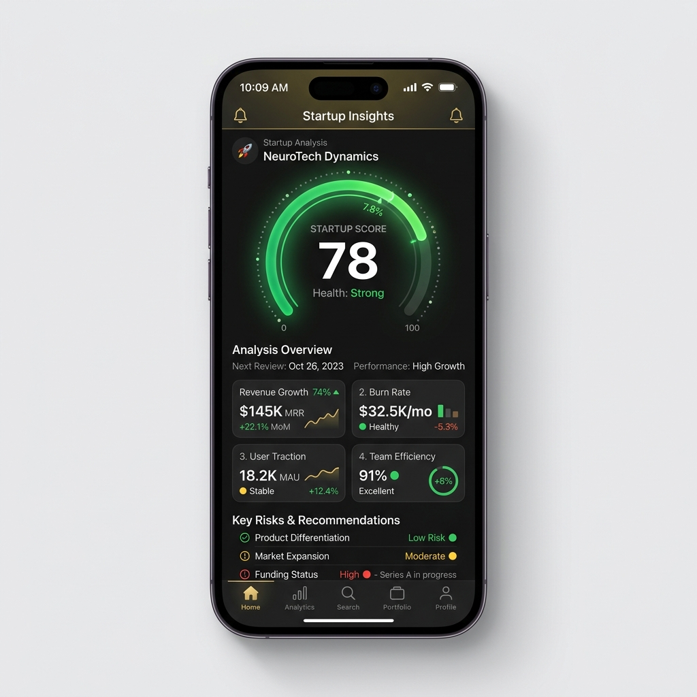

# Audit Report — HomeScreen Spacing & Layout Bug

**Screen Name:** `HomeScreen`
**Timestamp:** `2026-05-20T20:10:45+03:00`
**Priority:** `HIGH`

## Visual Ground Truth

## Issue Description
Ana ekrandaki analiz butonu (`PremiumButton`) ekran kenarlarına çok yakın duruyor ve tasarımı dikey/yatay düzlemde sıkıştırıyor. Buton üzerinde herhangi bir kenar boşluğu bulunmaması cihaz çerçeveleriyle görsel çatışmaya neden olmakta ve premium kullanıcı hissini zedelemektedir. Ayrıca buton kare (`isSquare`) yapıda olduğundan ana sayfa düzenine tam uyum sağlamıyor.

## Suggested Fix
1. Buton bileşenini (`PremiumButton`) tam genişlikte olacak şekilde `isSquare` özelliğinden arındırın ve başlığını `"Girişimi Analiz Et"` olarak güncelleyin.
2. `premium-button.tsx` altındaki kapsayıcı stile `marginHorizontal: 8` ve `marginTop: 16` özellikleri ekleyerek buton etrafındaki görsel nefes alma alanlarını genişletin.
